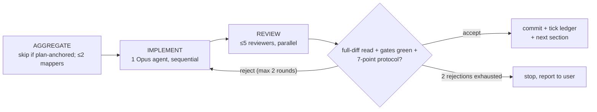
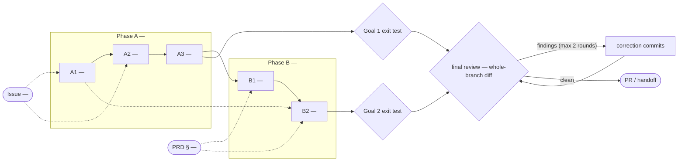

# <Project / Feature> — Goal-Driven Implementation Plan

Roadmap: <ROADMAP.md / PRD / ADR refs>
Written: <YYYY-MM-DD>

---

## 0. How to Use This File

### Roles

- Main session = ORCHESTRATOR + REVIEWER. It plans, dispatches, verifies, and commits.
  It never writes product code.
- Each SECTION = one implementation agent (Opus), dispatched by the orchestrator.
- The implementation agent may spawn up to 5 read-only sub-agents (context mapping,
  self-review). Only the implementation agent writes code.

### Execution Rule

Implementation is sequential.
Do not run two implementation agents at once.
Context aggregation and review passes run in parallel.

Each section runs this loop:

1. AGGREGATE — map relevant code/docs/tests (parallel, read-only). Skipped when the
   section's CONTEXT items already carry `file:line` anchors; ≤2 mappers for gaps only.
2. DECIDE — stop for contract/product decisions.
3. IMPLEMENT — build one vertical slice (single implementation agent).
4. SELF-VERIFY — run required gates.
5. REVIEW — run focused review passes (parallel, read-only).
6. REPORT — summarize diff, evidence, risks, deferrals.

Drawn once — this loop is identical for every section and every plan. The fan-outs are
the cost knobs; the reject edge is the only cycle, and it is capped:



### Global Gate

```bash
<mandatory test/build/lint/typecheck command — run it once before writing it here>
```

Rules:

- No unrun gate may be reported as success.
- Any schema/API/public contract change requires a decision brief first.
- Prefer one vertical slice per section.
- Do not drift into future sections.

### Expensive or Mutating Lifecycle Gate Budget

The global gate above is the cheap per-section gate. List separately every gate whose
repetition costs real time, money, or external state (full acceptance suite, package/image
build, schema migration, deployment, live e2e). A later input that changes what a gate
consumes voids its evidence — so place each gate after its final invalidating input and run
it the planned number of times, not once per section.

| Gate | Consumes / invalidated by | Planned runs | Why this count is safe |
|---|---|---:|---|
| <acceptance suite / build / migration / deploy / live e2e> | <source, schema, config it consumes> | <n> | <reason> |

### Approval-Time Contract Rulings

Pre-rule every ⚠ section here: bounded decisions the user approves together with the plan, so
contract floors are crossed at approval time, not mid-EXECUTE. Approval of this plan approves
exactly these rulings; anything broader remains an escalation.

1. <bounded decision — what is approved and what stays out of scope>
2. <...>

---

## 1. Goal — What "Done" Means

### Goal 1 — <Milestone Name>

Exit test:

- [ ] <observable production outcome>
- [ ] <security/reliability condition>
- [ ] <real user/system flow works end-to-end>
- [ ] <no stale state / no regression condition>

### Goal 2 — <Milestone Name>

Exit test:

- [ ] <reference flow works unattended>
- [ ] <audit/attribution/governance requirement>
- [ ] <failure mode degrades safely>
- [ ] <scheduled/recurring behavior works>

The plan is complete only when all exit tests pass.

---

## 2. Topology Graph & Recommended Order

### Topology Graph

The graph is the plan's primary approval surface — review shape before prose — and, at
completion, its trace. Conventions:

- One node per section, grouped by phase (`subgraph` per phase). Label: `ID — short title`.
- One stadium node per scope-justifying input — the issue, PRD section, or explicit ask
  that makes a section exist: `IN1(["Issue 123 — gist"])`. Provenance edges
  `IN -.-> section` say which requirement a section serves; they never affect sequencing.
  Reference material (ADRs, runbooks, precedents) stays in section prose, not the graph.
- Solid edge `-->` = hard dependency. Dashed edge `-.->` = soft dependency between sections,
  or provenance when it leaves a stadium input (the shape disambiguates).
- One diamond per goal exit test. **Every section must sit on a full path
  input → section → goal diamond** — no input edge means scope nobody asked for; no goal
  path means no exit test. And every input must reach at least one section — a dropped
  input is a requirement silently not covered.
- Suffix `⚠` on any section that can hit a contract floor (decision brief likely).
- Between the goal diamonds and the PR/handoff node sits the **final-review gate** — the
  whole-branch review that runs once at completion. Per-section review is already implicit
  in every section node (the §0 loop); the gate is the review of the assembled whole. Its
  capped correction loop is, with the §0 reject edge, one of only two legal cycles.
- Must agree with the DEPENDS ON lines and the ledger — if they diverge, fix before approval.
- At completion, annotate each node as-executed: `✅` clean accept · `🔁×n` rejection
  rounds · `⚠→` escalated (note the ruling). Approved graph = spec; annotated graph = trace.



### Graph Findings (analysis pass — runs before approval)

The orchestrator critiques the topology (orphans, unreachable goals, convergence
bottlenecks, unruled ⚠ nodes, misplaced or repeated lifecycle gates, blocking chains ≥4,
cycles) before presenting. Findings it
can fix by restructuring get fixed; the rest stand here as named accepted risks. "None" is
a valid entry only after the checklist actually ran. At completion, the as-executed trace
is checked back against this list.

- <finding class> — <node(s)> — <why it stands + what mitigates it>

### Hard Dependencies

- `<Section X>` must precede `<Section Y>` because `<reason>`.
- `<Section A>` blocks `<Milestone clause>`.

### Soft Dependencies

- `<Section B>` can be done earlier, but is sequenced after `<Section A>` to reduce churn.

### Recommended Linear Order

```text
A1 → A2 → A3 → B1 → B2 → C1 → C2 → D1
```

---

## 3. Sections

Each section uses this template:

```md
## <ID> — <Section Title>

GOAL:
<The outcome this section must produce.>

ROADMAP/PRD:
<Relevant roadmap, PRD, ADR, issue IDs.>

TARGET:
<Repo / service / subsystem.>

DEPENDS ON:
<Required previous sections, or "none".>

CONTEXT TO AGGREGATE:
1. <File/module/pattern to inspect>
2. <Existing tests to copy/extend>
3. <Relevant service/handler/store/UI path>
4. <Security/authz/config area>
5. <Migration/deployment/runtime concern>

IMPLEMENT:
- <Concrete vertical-slice change>
- <Data/model/API/UI changes>
- <Runtime behavior>
- <Backward compatibility requirement>
- <Docs/runbook updates if needed>

CONTRACT DECISION — ESCALATE:
Stop and return a decision brief before coding if this touches:
- public API shape
- config file format
- database schema beyond additive migration
- auth/token/permission model
- storage format
- external dependency / sovereignty boundary

Decision brief format:
- Product effect
- 2–4 options
- Consequences
- Recommendation
- Evidence references

VERIFY:
- Run global gate.
- Run subsystem-specific tests.
- Run live/e2e flow:
  - <step 1>
  - <step 2>
  - <expected observable result>

REVIEW:
1. Security/authz review
2. Data/migration correctness review
3. Contract/API compatibility review
4. Failure-mode/reliability review
5. Convention/scope review

ACCEPTANCE:
<Specific exit-test clause this satisfies.>

COMMIT:
<type(scope): concise message (REF-ID)>
```

---

## 4. Main-Session Review Protocol

Before accepting a section, read the full section diff (points 5–6 are judged against the
diff, not the implementer's report), then verify:

1. Gate evidence is shown and green.
2. Required DB/integration/e2e tests were actually run.
3. No contract floor was crossed without approval.
4. Acceptance maps to a milestone exit test.
5. Scope stayed inside the section.
6. Conventions were followed.
7. Deferrals are explicit and safe.

Approve → commit → update ledger → dispatch next section.
Reject → return exact gaps to the same agent.

---

## 5. Progress Ledger

## Phase A — <Milestone / Subsystem>

[ ] A1 <Section title> — <exit clause>
[ ] A2 <Section title> — <exit clause>
[ ] A3 <Section title> — <exit clause>

## Phase B — <Milestone / Subsystem>

[ ] B1 <Section title> — <exit clause>
[ ] B2 <Section title> — <exit clause>

## Phase C — <Service / External / Ops>

[ ] C1 <Section title>
[ ] C2 <Section title>

## Phase D — Verification / Rollout

[ ] D1 <Ops rollout>
[ ] D2 <Governance verification>

DONE when:

- [ ] Goal 1 exit test passes.
- [ ] Goal 2 exit test passes.
