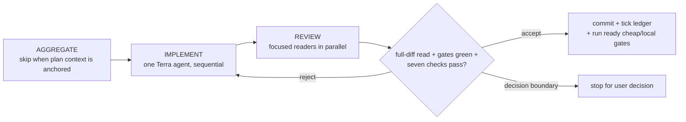
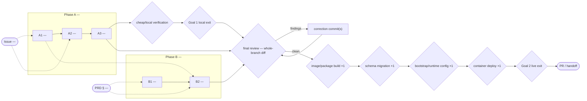

# <Project / Feature> — Goal-Driven Implementation Plan

Sources: <roadmap / PRD / ADR / issue references>
Written: <YYYY-MM-DD>

## 0. Execution contract

### Roles

- Main Codex session: orchestrator and reviewer; prefer `gpt-5.6-sol` at `max`. It plans,
  dispatches, verifies, updates this ledger, and commits. It never edits product source code.
- The main session is the sole orchestrator by default. A delegated Sol orchestrator is permitted
  only for a bounded multi-section subtree when its ability to spawn and steer Terra subagents is
  confirmed; it never edits, accepts, or commits.
- Section implementer: exactly one agent at a time. It writes code only for its active section,
  does not commit, and does not spawn subagents.
- Explorers and focused reviewers: read-only; may run in parallel within available agent slots.

### Model routing

- Orchestrator: `gpt-5.6-sol` / `max`.
- Implementer: `goal-implementer-terra` (`gpt-5.6-terra` / `xhigh`).
- Explorer: `goal-explorer` (`gpt-5.6-terra` / `medium`).
- Reviewer: `goal-reviewer` (`gpt-5.6-terra` / `high`).
- All ordinary spawned roles use Terra. Never spawn a Sol peer worker or reviewer. The only Sol
  child permitted is the delegated orchestrator defined above. If Terra profile selection is
  unavailable, stop before product edits; never inherit the Sol orchestrator route for a worker.
  Record requested routing, role-confirmation evidence, model/effort-confirmation evidence, and any
  failure to route in the ledger/status.

### Global gate

```bash
<mandatory test/build/lint/typecheck command, successfully run before plan approval>
```

Baseline result: <date, exit code, decisive output>

### Execution-environment preflight

Preflight status: pending
Checked: pending
Baseline SHA: pending
Execution realm: pending

Use `ready`, `known-baseline-red`, or `invalid-environment` after running the probes. A known
baseline red must be reproducible and unrelated, and the plan must still name a narrower real green
global gate. Record presence and reachability only; never record secret values.

| Capability | Probe / expected condition | Observed evidence | Classification |
|---|---|---|---|
| Worktree and branch | Correct repository/branch; unrelated changes isolated | `<result>` | `<ready / invalid-environment>` |
| Toolchain and agent routing | Required Node/pnpm/tool versions and Terra route available | `<result>` | `<ready / invalid-environment>` |
| Required infrastructure | DB/Redis/Docker/service DNS and ports needed by gates are reachable | `<result or not-required>` | `<ready / invalid-environment / not-required>` |
| Credentials / external authority | Required values are present and approved without exposing them | `<result or not-required>` | `<ready / invalid-environment / not-required>` |
| Host resources | Required paths are writable; disk and memory are adequate | `<result>` | `<ready / invalid-environment>` |
| Baseline gate | The declared global gate has a valid observed result | `<result>` | `<ready / known-baseline-red>` |

### Expensive or mutating lifecycle gate budget

List every gate whose repetition costs meaningful time, money, risk, or external state. A later
input that changes what the gate consumes invalidates its evidence.

| Gate | Consumes / invalidated by | Planned runs | Why this count is safe |
|---|---|---:|---|
| `<schema/bootstrap gate>` | `<migrations, role grants, generated credential>` | `<n>` | `<reason>` |
| `<package/image build>` | `<source, lockfile, build args, generated assets>` | `<n>` | `<reason>` |
| `<deployment + live e2e>` | `<image, runtime env/config/credentials, schema readiness>` | `<n>` | `<reason>` |

### Approval-time contract rulings

Pre-rule every `⚠` section here: bounded decisions the user approves together with the plan, so
contract floors are crossed at approval time rather than mid-execution. Approval of this plan
approves exactly these rulings; anything broader remains an escalation.

1. <bounded decision — what is approved and what stays out of scope>

### Rules

- Implementation is sequential; never run two implementers concurrently.
- No unrun gate may be reported as successful.
- Preserve and exclude unrelated pre-existing working-tree changes.
- Approval of EXECUTE or an active Codex `/goal` authorizes routine in-contract correction rounds
  until each section converges; reviewer rejection alone is not a user decision boundary.
- Stop for a decision before changing a schema, public contract, auth model, storage format, or
  external trust/sovereignty boundary beyond what this plan explicitly approves.
- Do not drift into future sections.

This loop applies to every section. The correction edge remains inside the approved contract:



## 1. Goals — observable definition of done

### Goal 1 — <milestone>

- [ ] <observable production outcome>
- [ ] <security/reliability condition>
- [ ] <real user/system flow succeeds end to end>
- [ ] <no stale state or regression condition>

### Goal 2 — <milestone>

- [ ] <observable outcome>
- [ ] <audit/attribution/governance requirement>
- [ ] <failure mode degrades safely>

The plan is complete only when every goal exit test passes. Run cheap/local exit checks as soon as
their incoming topology dependencies are accepted. Schedule rebuild/deploy/live checks according to
the lifecycle gate budget after their last invalidating input, then re-run non-mutating exit checks
at completion.

## 2. Topology graph and recommended order

### Topology graph

This graph is the primary plan-approval surface and becomes the execution trace at completion.

- Create one stadium node per scope-justifying input: issue, PRD clause, or explicit request.
  Dashed provenance edges from an input to sections show which requirement each section serves.
  Keep reference-only ADRs, runbooks, and precedents in section prose.
- Create one node per section and group sections by phase. Use solid edges for hard dependencies
  and dashed edges for soft ordering. Suffix `⚠` on a section likely to cross a contract floor.
- Create explicit nodes for generated config/credentials, migrations/bootstrap, package/image
  builds, deployments, and live end-to-end gates when their repetition matters. Connect every
  producer or invalidator and label the planned run count, such as `build/deploy ×1`.
- Classify config and credentials as build inputs, runtime/container inputs, or external-state
  prerequisites. Distinguish image build from container recreation/deployment. Extract migration
  or bootstrap from implicit service startup when the approved operations contract safely allows
  it.
- Create one diamond per goal exit-test gate. Run cheap/local gates when ready, but place expensive,
  mutating, or invalidation-sensitive gates after their final input unless the lifecycle budget
  explicitly justifies an earlier extra run.
- Put the whole-branch source/diff review on every path to PR/handoff and before any external or
  mutating lifecycle gate that its corrections could invalidate. Put live goal gates after the
  deployment they observe. Per-section review is already represented by the loop in section 0.
- Put every section on a complete input → section → goal path. Every input must reach at least one
  section, and every goal diamond must have an incoming path.
- Keep the graph, `DEPENDS ON` clauses, goal checkboxes, ledger, and recommended order identical in
  meaning. The section graph must be acyclic.
- At completion annotate nodes: `✅` clean acceptance; `🔁×n` rejection rounds; `⚠→` escalated
  decision plus ruling. Annotate the final-review node `✅` or `🔁×n` correction commits.



### Graph Findings

Run the topology-analysis checklist before approval. Record structural problems fixed during plan
authoring and risks deliberately accepted. `None` is valid only after checking orphans, unanchored
sections, unreachable goals, dropped inputs, gateless handoff, convergence bottlenecks, unruled
`⚠` nodes, misplaced verification, repeated lifecycle gates, conflated implementation/rollout
dependencies, wrong invalidation boundaries, implicit startup coupling, false/long blocking
chains, and cycles.

Resolved before approval:

- <finding class> — <node(s)> — <original problem> — <topology/order correction>

Accepted risks:

- <finding class> — <node(s)> — <why it remains> — <mitigation and review point>

### Hard dependencies

- `<Section X>` precedes `<Section Y>` because `<reason>`.

### Soft dependencies

- `<Section B>` follows `<Section A>` to reduce churn, but is not blocked by it.

### Recommended linear order

Among safe topological orders, minimize repeated lifecycle gates first, then surface cheap feedback
as early as possible. Show lifecycle outputs and gates explicitly:

```text
<implementation producers> -> <cheap/local gates when ready> -> whole-branch review -> image build ×1 -> schema migration ×1 -> runtime bootstrap/config ×1 -> container deploy ×1 -> live goal gates -> PR/handoff
```

## 3. Sections

Use this block for every S/M vertical slice:

```md
## <ID> — <section title>

GOAL:
<Observable outcome.>

SOURCES:
<Roadmap, PRD, ADR, or issue clauses.>

TARGET:
<Repository / service / subsystem.>

DEPENDS ON:
<Checked section IDs, or "none".>

IMPLEMENTER PROFILE:
goal-implementer-terra (`gpt-5.6-terra` / `xhigh`).

CONTEXT TO AGGREGATE:
1. <File/module/pattern to inspect.>
2. <Existing tests to extend.>
3. <Relevant runtime path.>
4. <Security/config/migration concern.>

LIFECYCLE / GATE EFFECTS:
- Produces: <artifact, schema, config, credential, or external state>.
- Binding: <image build input, runtime/container input, or external-state prerequisite>.
- Consumed by: <build/deploy/bootstrap/live gate IDs>.
- Invalidates prior evidence from: <gate IDs, or "none">.
- External mutation/repetition cost: <what changes and why ordering matters>.

IMPLEMENT:
- <Concrete vertical-slice behavior.>
- <Data/model/API/UI change.>
- <Backward-compatibility constraint.>
- <Docs/runbook update if required.>

CONTRACT DECISION — ESCALATE:
Stop before coding if the work requires an unapproved change to:
- public API or config shape
- non-additive database schema
- authentication, token, or permission model
- persistent storage format
- external dependency or trust/sovereignty boundary

Decision brief: product effect; 2-4 options; consequences; recommendation; evidence.

VERIFY:
- Global gate: <command>.
- Subsystem tests: <commands>.
- Live/end-to-end flow: <steps and expected observable result>.

REVIEW:
<Applicable dimensions: security, data, contract, reliability, convention/scope.>

ACCEPTANCE:
<Exact Goal exit-test clause satisfied.>

COMMIT:
<type(scope): concise message (reference)>
```

## 4. Main-session acceptance protocol

Before accepting a section, verify green gate evidence, required integration/end-to-end tests,
approved contract changes, goal mapping, section-bounded scope, repository conventions, and safe
explicit deferrals.

Reviewer approvals require concrete `file:line` evidence. On approval, normally update the ledger
and commit only the section diff plus this ledger change. If acceptance requires post-push CI for
the exact product commit SHA, first commit and push only the product change, observe exact-SHA CI,
then commit and push a ledger-only evidence update and verify its required CI. Never amend the
pushed product commit; acceptance completes only after the ledger evidence is recorded and green.
On rejection, record the exact gaps, resume the same implementer, and repeat affected reviews and
gates until acceptance. Do not request authorization based on correction count or token use. Pause
only for a genuine unapproved contract/scope decision, new external authority or irreversible
action, unsafe isolation, unavailable required Terra routing, or an explicit per-round gate in the
approved plan.

## 5. Progress ledger

## Phase A — <milestone / subsystem>

- [ ] A1 <section title> — <exit clause> — profile: <profile> — routing: requested=<...>; role=<pending>; model/effort=<pending>; fallback=<none>
- [ ] A2 <section title> — <exit clause> — profile: <profile> — routing: requested=<...>; role=<pending>; model/effort=<pending>; fallback=<none>

## Phase B — <milestone / subsystem>

- [ ] B1 <section title> — <exit clause> — profile: <profile> — routing: requested=<...>; role=<pending>; model/effort=<pending>; fallback=<none>
- [ ] B2 <section title> — <exit clause> — profile: <profile> — routing: requested=<...>; role=<pending>; model/effort=<pending>; fallback=<none>

## Completion

- [ ] Every section is committed.
- [ ] Goal 1 exit tests pass with evidence.
- [ ] Goal 2 exit tests pass with evidence.
- [ ] Whole-branch final review is clean before external/mutating lifecycle gates and any correction commits are verified.
- [ ] Topology graph is annotated as executed, re-rendered, and compared with Graph Findings.
- [ ] Requested routes, confirmed roles, confirmed model/effort, fallbacks, and deferrals are reported.

## Deferrals

None.

When an item intentionally remains, replace `None.` with rows. Every deferral must say what milestone
it blocks; an out-of-scope future enhancement normally blocks `none`.

| ID | Class | Remaining work and risk | Owner / issue | Re-entry gate | Blocks | Status |
|---|---|---|---|---|---|---|
| `<D1>` | `<coverage / environment / external-authority / product-scope>` | `<work and risk>` | `<owner or issue>` | `<observable gate>` | `<implemented / verified / shipped / none>` | `<open / resolved>` |
