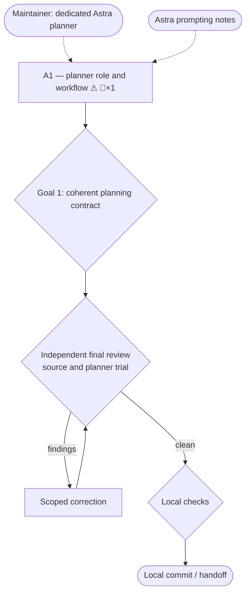

# Dedicated planner — Goal-Driven Implementation Plan

Sources: maintainer request, 2026-09-12; supplied “Rethinking skills and prompts for GPT-6 Astra”.
Written: 2026-09-12
Skill source: repository skills/goal-driven-implementation at b97b89bb; execution guidance also
read from C:/Users/DiegoPC/.agents/skills/goal-driven-implementation/SKILL.md.
Feature map: temporary gdi-goal-planner-feature-map.yml; flat repository, zero shared kernels.

## Premise corrections

- At the recorded baseline, Codex policy joined planning and orchestration and forbade a planner child
  (skills/goal-driven-implementation/references/routing-codex.md:5). The maintainer explicitly
  requests replacing that responsibility assignment and route.
- This is a Markdown skill with dependency-free Node tools. There is no application build or
  live product deployment in this task.

## 0. Execution contract

### Roles

- Main session authors this implementation plan under the existing workflow, receives mapping,
  reviews, updates the ledger, verifies, and commits. Product prose changes belong to one implementer.
- Mapper: read-only context gathering before implementation. New-role forward validation follows
  implementation and uses supplied mapper evidence.
- Implementer: one Luna max agent, no delegation, no plan or ledger edits, no commits.
- Reviewers: independent Terra xhigh agents; inspect relevant contracts and claims.

### Harness routing

| Role | Requested | Role-confirmed | Model/effort-confirmed | Fallback used |
| --- | --- | --- | --- | --- |
| Orchestrator / current planner | existing root | main session | unknown | none |
| Mapper | goal-explorer / Luna max | unknown | unknown | direct Luna max; loaded custom role is stale |
| Implementer | goal-implementer / Luna max | unknown | unknown | direct Luna max; current role unavailable |
| Reviewer | goal-reviewer / Terra xhigh | unknown | unknown | direct Terra xhigh; loaded custom role differs |
| Planner forward trial | goal-planner / Astra xhigh | unknown | unknown | direct Astra xhigh with new profile instructions; draft returned to parent for persistence |

### Global gate

Run the three script self-tests, render this real plan with --no-open, run installer --dry-run,
parse the new TOML, validate skill frontmatter, and check LF/NUL and git diff whitespace.
Run once against the reviewed implementation, reusing valid unchanged evidence.

### Execution-environment preflight

Preflight status: ready
Checked: 2026-09-12
Baseline SHA: b97b89bb0652d98c410c45df07eb4cf13dc7dd5c
Execution realm: local Windows PowerShell; development repository.

| Capability | Probe / expected condition | Observed evidence | Classification |
| --- | --- | --- | --- |
| Toolchain | Node and Python parsers | Node v24.11.1; Python 3.13.12; tomllib and yaml import | ready |
| Repository | clean tracked baseline | clean main; branch codex/goal-planner; fetched origin/main equals baseline | ready |
| Baseline gate | plan compatibility fixtures | validate-plan self-test passed (schema 2 + legacy schema 1) | ready |
| Browser | supported graph capture | preferred browser bridge unavailable; try supported alternative | not-required |

#### Known blockers

| Condition | Detection | Pre-approved handling |
| --- | --- | --- |
| Installed roles lag source | exposed custom role metadata differs from current files | explicit supported direct model/effort fallback; record unknown runtime evidence |
| Preferred browser bridge unavailable | setup reports bridge not trusted | try supported browser alternative; honestly record unperformed visual inspection if unavailable |
| Windows command-length limit while saving a trial draft | shell invocation fails before creating file | use direct patch or bounded file writes within the assigned temporary directory |

### Expensive or mutating lifecycle gate budget

| Gate | Consumes / invalidated by | Planned runs (impl / orch) | Preflight | Actual runs | Why this count is safe |
| --- | --- | ---: | --- | ---: | --- |
| Local self-tests and installer dry-run | final scripts and agent inventory | 0 / 1 | proven | 1 | implementer evidence reused; no installation or external mutation |
| Plan validation and rendering | plan and Mermaid | 0 / 2 | proven | 2 | before execution and ledger annotation; intermediate plan-only validations also passed |
| Planner forward trial | new profile and shared planning instructions | 0 / 1 | proven for drafting/validation; visual inspection unavailable | 1 | one independently authored draft, persisted by parent after shell-length failure; no product execution |

### Rulings

#### Floor rulings (the user owns these)

| # | Section | Decision | Options | Recommendation | Ruling |
| --- | --- | --- | --- | --- | --- |
| F1 | A1 | Separate Codex planner from flexible orchestrator; replace the root-only/no-planner-child rule | existing combined route / dedicated Astra xhigh planner | dedicated planner after mapping | ruled 2026-09-12: explicit maintainer request |
| F2 | A1 | Planner default model and effort | Astra xhigh | Astra xhigh | ruled 2026-09-12: explicit maintainer request |

Terminal action: local commit. Publishing, release bump, home installation, and user config edits
are outside this request.

#### Recorded calls (orchestrator-ruled under the floor, user-vetoable)

| # | Section | Call | Rationale |
| --- | --- | --- | --- |
| R0 | all | ⇢ lane: full | responsibility reassignment touches the declared floor; already authorized |
| R1 | A1 | ⇢ Preserve Claude main-session planning and current worker/reviewer routes | request specifies the Codex planner; no new Claude pin is needed |
| R2 | A1 | ⇢ Keep plan/report validators and schema unchanged | planner returns an existing plan artifact, not a new required machine report |
| R3 | A1 | ⇢ Concise planner prompt in existing references | supplied Astra guidance favors relevant context, clear outcomes, and progressive disclosure |
| R4 | A1 | ⇢ Run the temporary planner trial alongside final source review after corrections | it reviews the new instruction contract without executing product; feed any behavioral findings into the same correction loop |
| R5 | A1 | ⇢ Reuse implementer's complete script and packaging evidence at final gates | R1 changed README and routing wording only; validator, scout, installer, TOML, and frontmatter inputs remain unchanged |

### Base drift policy

Fetch origin/main and verify ancestry before final review. If it advanced, merge with the local
branch and review the merged tree. Do not rewrite published history.

### Rules

- One product implementer; mappers and reviewers read only.
- Preserve historical claude/ and codex/ directories and the release version.
- Preserve existing authorization, plan compatibility, independent review, and evidence reuse.
- The orchestrator owns acceptance and commits; planner authority ends at the assigned plan.

## 1. Goals — observable definition of done

### Goal 1 — Dedicated planning works independently of the root model

- [x] Codex installer includes goal-planner with gpt-6-astra and xhigh; orchestrator model remains user-selected.
- [x] Validated mapper context precedes plan authorship; planner owns decomposition and graph inspection.
- [x] Planner boundaries and handoff preserve approval, ledger, implementation, and review ownership.
- [x] Workflow, prompt, profile, template, installer, and README agree; legacy plans still validate.

## 2. Topology graph and recommended order

### Topology graph

### Graph Findings

- Structural: both inputs reach A1 and Goal 1; final review precedes final checks and handoff;
  only the correction loop cycles. One section has no dependency or convergence bottleneck.
- Scope: role/profile, prompt, shared workflow, routing, template, installer, and README are one
  coherent slice. No consolidation target or unrelated rule rewrite.
- Contract: F1/F2 already ruled by the maintainer. Preserve schema, old role names, install
  directories, all other model pins, and review lenses. No commercial or API state.
- Reader sweep: new role inventory is consumed by installer wildcard copy, printed registration,
  routing guidance, README counts/layout, and skill resources; all are in A1 scope.
- Data: no shared data values, schema migrations, or rollout window.
- Lifecycle: no build/deploy gates or generated tracked metadata; local render outputs are temporary.
- Environment: stale installed roles use direct pinned fallbacks; missing browser evidence must
  remain explicit. No production or credential probes.
- Evidence: script self-tests establish compatibility; TOML parsing and installer output establish
  packaging; independent prompt trial checks decisions that text matching cannot prove.
- Visual inspection: unperformed. HTML generation passed (one graph). Preferred browser bridge
  was unavailable; the supported browser alternative rejected the local file URL under its
  security policy. No bypass attempted. Source checks establish the paths above, not visual evidence.
- Completion trace: anticipated stale role inventory and unavailable visual tools occurred and
  were recorded honestly. No schema/legacy-plan rejection or other role-pin change occurred.
  Review caught the README mapping-exception omission and graph-source/capture ownership ambiguity;
  R1 corrected both. The trial also exposed a Windows command-length limit while saving its draft;
  this is an environment retry, not a product rejection or a new workflow requirement.

### Corrections in force

- 2026-09-12 — mapping confirms a normal planner-authored plan and extra routing row need no
  schema or validator change. Mapper report validates with zero warnings (four anchors).
  The first report's abbreviated anchor paths were corrected by the same mapper before merging.

### Hard dependencies

- None between sections.

### Soft dependencies

- None.

### Recommended linear order

A1 -> section review -> re-baseline -> final review with draft-only trial -> required checks -> local commit.

## 3. Sections

## A1 — Dedicated Codex planner and coherent handoff

GOAL:
Satisfy Goal 1 without tying the orchestrator's model to plan quality.

SOURCES:
Maintainer request and supplied Astra prompting notes, 2026-09-12.

TARGET:
Flat repository. Allowed product files: skills/goal-driven-implementation/SKILL.md;
references/agent-prompts.md, graph-analysis.md, routing-codex.md, routing-claude.md under that
skill; assets/plan-template.md; assets/agents/codex/goal-planner.toml (new) and goal-reviewer.toml;
README.md; scripts/install.mjs; CHANGELOG.md. Other role prose only if needed for agreement,
without pin changes. Exclude frozen forks, VERSION, validators, home installs, and user config.

DEPENDS ON:
none.

IMPLEMENTER PROFILE:
goal-implementer / gpt-5.6-luna / max; direct fallback with full standing contract.

CONTEXT TO AGGREGATE:
1. skills/goal-driven-implementation/references/routing-codex.md:5 — current combined root route.
2. skills/goal-driven-implementation/assets/plan-template.md:24 — role and routing declarations.
3. scripts/install.mjs:53 — wildcard agent inventory and printed registration below it.
4. skills/goal-driven-implementation/references/agent-prompts.md:1 — shared dispatch format.

WRITERS:
Planner drafts the plan; main session updates approval and progress; implementer writes product.
The current shared contract is skills/goal-driven-implementation/SKILL.md:21.

SIBLING SURFACES:
Claude routing remains main-session planner/orchestrator. Existing implementer and reviewer
profiles retain all pins; model-neutral names remain stable.

LIFECYCLE / GATE EFFECTS:
- Produces: one new Codex role profile and updated product instructions/registration snippet.
- Binding: installed profile discovery requires installation and runtime reload after this task.
- Consumed by: local packaging checks and planner forward trial.
- Invalidates prior evidence from: planner-routing behavioral assumptions, not legacy validators.
- Tracked generated artifacts: none; plan renders and trial outputs remain temporary.

IMPLEMENT:
- Add goal-planner pinned gpt-6-astra/xhigh with plan-artifact-only writes, no delegation,
  execution, acceptance, or commits. Keep role/model evidence honest and distinct.
- Route Codex orchestration to the existing user-selected capable session (Sol 5.6/Astra examples).
  Dispatch one planner after required mappers finish and reports validate. Reuse fresh context;
  retain proportionate mapping exceptions. Missing planner route must not silently downgrade.
- Add a concise shared planner prompt using mapped context, open questions, scope, existing
  rulings, plan/artifact paths, and completion criteria. Planner authors and checks the plan;
  root handles probes/capture when needed, actual rulings, ledger, and execution.
- Maintain serial ownership of plan writes across initial draft, handoff, and bounded replans;
  keep completed history. No redundant planner on EXECUTE resume when no replan is needed.
- Reassign graph inspection consistently across workflow/reference/reviewer prose; Claude keeps
  its current main-session route. Explain new planner role and unchanged schema compatibility.
- Update installer registration, README inventory/layout, skill resources, and Unreleased
  changelog with maintainer evidence and supplied prompt guidance. Do not bump VERSION.

CONTRACT DECISION — ESCALATE:
F1/F2 authorize the requested planning changes. Any additional declared-floor change needs a
new ruling; prepare independent permitted work first. Routine choices stay with the orchestrator.

VERIFY:
- Implementer: parse new TOML and inspect installer --dry-run for role/registration parity.
- Main session final stage: all host-required self-tests, real plan render --no-open, dry-run,
  skill frontmatter, line endings, and diff checks. Reuse valid implementer evidence.
- Independent planner trial: use new instructions with anchored mapper context in temporary
  storage alongside final source review; inspect the returned plan and decisions. No execution
  or product edits. Rerun only if corrections invalidate the exercised planner instructions.
- No live product flow is required; no application behavior is changed.

REVIEW:
Contract/API, failure-mode/reliability, convention/scope, doc-truth; security/authz and data
checks assess planner write boundaries and preservation of plan history. Capacity and evaluator
lenses do not apply (no admission policy or journey evaluator).

ACCEPTANCE:
Every Goal 1 clause has passing artifact, behavior, or review evidence.

COMMIT:
feat(skill): add dedicated Astra goal planner

## 4. Main-session acceptance protocol

Verify passing applicable gates, scope, conventions, truthful claims, authorized floor changes,
explicit deferrals, and goal evidence. Read the complete diff. Resume the same implementer for
concrete corrections. Never treat a generated HTML file or requested role selector as runtime proof.

## 5. Progress ledger

- [x] A1 Dedicated Codex planner and coherent handoff — Goal 1 — accepted 2026-09-12 (commit containing this ledger) — rounds: 1 — review: independent — routing: requested=Luna max implementer/Terra xhigh reviewers; role=unknown; model/effort=unknown — cost: unknown — env-retries: 0
  - R1 contract: README must retain the verified-context mapping exception; exclusive planner
    source ownership must allow orchestrator temporary render/capture artifacts.

## Completion

- [x] A1 accepted; this commit contains the section and its ledger record.
- [x] Current origin/main ancestry and independent final review are clean.
- [x] Required checks, planner trial, and Goal 1 exit evidence recorded.
- [x] Routing, gate counts, graph marks, and deferrals reflect observed results.

### Verification evidence

- Initial and R1 implementer reports passed `validate-report --kind implementer` with zero
  warnings (34 and 36 anchors). Mapper return passed with four anchors after one path-format fix.
- Six independent section lenses completed. Contract found two wording inconsistencies; the
  same implementer corrected them, and the same reviewer approved. The remaining five lenses
  approved. Two independent final reviews (whole-surface contract and claim decay) returned CLEAN;
  both final reports validated with eight anchors and zero warnings.
- Fresh `git fetch origin` and ancestry check: `origin/main` and branch HEAD remained
  b97b89bb0652d98c410c45df07eb4cf13dc7dd5c before the implementation commit. Review included the
  complete working tree on that base.
- Implementer ran all three repository self-tests: plan validation (schema 2 and legacy schema 1),
  repository scout, and report validation passed. TOML parsing identified goal-planner,
  gpt-6-astra, xhigh, workspace-write. Installer dry-run listed the new TOML and matching legacy
  registration. Node installer syntax check passed. These inputs were unchanged by R1.
- Main-session skill `quick_validate.py`: `Skill is valid!`; final whitespace check passed;
  LF/NUL check passed across all 13 changed files.
- Planner trial requested direct Astra xhigh after receiving the verified installer context.
  It independently authored one schema-2 draft for a hypothetical --list-targets flag, reused
  the existing copy inventory, preserved current flag behavior, left approval pending, and
  kept future implementation and gates unexecuted. No repository product or ledger was changed
  by the trial. The draft's plan validator passed; anchor validation passed with 26 anchors and
  zero warnings; HTML generation reported one graph and one ledger item.
- Trial limitation: its large PowerShell write failed before creating an artifact. After the
  author returned the complete draft, the orchestrator persisted it verbatim under the assigned
  temporary directory and ran the checks. This validates independent drafting and handoff,
  not uninterrupted agent-side file writing or runtime custom-role discovery. Count one
  environment retry, separate from A1's single product correction round. Visual inspection of
  both generated graphs remains unperformed under the recorded browser policy restriction.
- Final plan graph was regenerated with --no-open after ledger annotation; source marks reflect
  A1 acceptance and its one correction round. Generated HTML and trial output remain temporary.
- Available usage: unknown for mapping, implementation, six section lenses, two final lenses,
  planner trial, correction work, and main-session overhead. Requested routes are recorded above;
  neither tool acceptance nor agent self-description establishes runtime model/effort.

## Deferrals

None.
