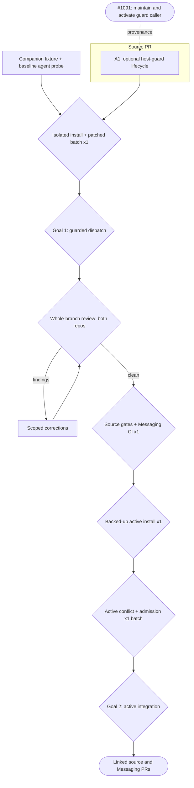

# Issue 1091 — Optional repository dispatch-guard integration

Sources: [Tyxter #1091](https://github.com/carboni123/tyxter-messaging/issues/1091), explicit user request.
Written: 2026-09-26.
Skill source: `/home/iac-deploy/.agents/skills/goal-driven-implementation`, installed 0.8.0;
implementation checkout `/tmp/1091-gdi-source` at `fd45932354f864a76ffb9b729ecdc1c4d760400f`.
Feature map: flat repository; one shipped skill plus installer, no package/build/CI.
Companion: `carboni123/tyxter-messaging`, `docs/plans/issue-1091-core-dispatch-plan.md`.
Companion owns the real-guard fixture, case matrix, archive and Messaging CI; this ledger records
only source-repository commits. Two linked PRs, one orchestrator and one writer globally.

## Premise corrections

- W — Clean source EXECUTE preflight verifies local implementer state but invokes no host guard
  (`skills/goal-driven-implementation/SKILL.md:342`). Original maintained checkout contains six
  unrelated dirty files: never edit or publish them. Clean source is the implementation basis.
- W — Installer already supports both Codex discovery copies and preserved agent definitions
  (`scripts/install.mjs:72`). No installer change or version/schema bump is needed.
- W — Guard policy belongs to the host. This skill supplies an optional invocation path, not core
  membership, a distributed lock, or mandatory gating for repositories without that integration.

## 0. Execution contract

### Roles

Root orchestrates, reviews, owns rulings/status/ledger/commits and activation. Planner writes only
plans/graphs. One implementer writes the active section without delegation; independent reviewers
read. Fixture forward testing follows the companion's bounded evaluator/child-writer assignment.

### Harness routing

Harness: `codex`; registered custom profiles are stale, so explicit generic routes are used.

| Role         | Requested             | Role-confirmed | Model/effort-confirmed | Fallback used              |
| ------------ | --------------------- | -------------- | ---------------------- | -------------------------- |
| Orchestrator | existing main session | main session   | unknown                | none                       |
| Plan author  | gpt-6-astra / xhigh   | unknown        | unknown                | generic planner            |
| Implementer  | gpt-6-sol / high      | unknown        | unknown                | generic worker             |
| Mapper       | gpt-6-luna / high     | unknown        | unknown                | generic read-only mapper   |
| Reviewer     | gpt-6-sol / medium    | unknown        | unknown                | generic read-only reviewer |

Attestation none; runtime and cost unknown. Existing role definitions/config remain byte-identical.

### Global gate

From the clean source root, after whole-branch review:

```bash
node skills/goal-driven-implementation/assets/validate-plan.mjs --self-test
node skills/goal-driven-implementation/assets/validate-report.mjs --self-test
node skills/goal-driven-implementation/assets/scout-repo.mjs --self-test
node skills/goal-driven-implementation/assets/render-plan-graph.mjs docs/plans/issue-1091-core-dispatch-plan.md --no-open --out /tmp/1091-plan-graph-source.html
node scripts/install.mjs --dry-run
```

Also run skill-creator's quick validator on the shipped skill. No native build exists. Baseline:
root observed installed-root plan/report self-tests passing and clean-source Codex/no-agents dry-run
passing; scout, installed forward behavior and final candidate gates remain scheduled below.

### Execution-environment preflight

Preflight status: ready
Checked: 2026-09-26
Baseline SHA: fd45932354f864a76ffb9b729ecdc1c4d760400f
Execution realm: Linux `/tmp/1091-gdi-source`; isolated installer destination through task-only homedir shim

<!-- prettier-ignore -->
| Capability | Probe / expected condition | Observed evidence | Classification |
| --------------- | ------------------------------------------- | ------------------------------------------------------------------------------- | -------------- |
| Worktree        | clean source task branch                    | root confirmed; six original dirty-file hashes saved separately                 | ready          |
| Tools/routing   | Node, Git, independent roles                | Node 24.20; Git/gh; requested routes above                                      | ready          |
| Infrastructure  | dependency-free source scripts              | no database/provider services required                                          | ready          |
| Authority       | source PR and active installation requested | root recorded user authorization; gh authenticated                              | ready          |
| Resources       | writable /tmp and target directories        | root reports about 163 GB free                                                  | ready          |
| Baseline copies | preserve both active skills                 | `/tmp/1091-baseline-agents`, `/tmp/1091-baseline-codex`; hash manifest retained | ready          |
| Installer realm | dry-run Codex/no-agents                     | root dry-run and isolated real installation passed                      | ready          |

Representative gate probe: `node scripts/install.mjs --dry-run --only codex --no-agents`, exit 0.
Root also passed the real isolated installer preflight using `/tmp/1091-isolated-install-home.mjs`
and `TYXTER_1091_INSTALL_ROOT=/tmp/1091-install-baseline`: both installed copies match all 21
source files. No HOME/home/CODEX_HOME override. Native forward testing and actual home mutation
remain unproven; reuse this task-only homedir preload for the patched candidate.

#### Known blockers

<!-- prettier-ignore -->
| Condition | Detection | Pre-approved handling |
| -------------------------------------------- | -------------------------------- | ------------------------------------------------------------------------------------- |
| Dirty original checkout differs from release | preserved six-file hash manifest | work only in clean task clone; compare hashes before handoff                          |
| Stale registered custom roles                | routing preflight                | explicit generic requested routes; no config/role changes                             |
| Fixture Git context leaks                    | inherited selector variables     | companion runner scrubs child selectors                                               |
| Mermaid/CDN capture failure                  | browser has raw block/error      | use available Playwright/Chromium capture; report unperformed if unavailable          |
| Isolated-home installer realm unsupported    | files escape task fixture        | stop before active install; inspect installer behavior, bounded replan if code needed |

### Expensive or mutating lifecycle gate budget

| Gate                                           | Consumes / invalidated by                           | Planned runs (impl / orch) | Preflight                          | Actual runs | Why this count is safe                                    |
| ---------------------------------------------- | --------------------------------------------------- | -------------------------- | ---------------------------------- | ----------- | --------------------------------------------------------- |
| Baseline native-agent probe                    | companion fixture and immutable baseline            | 0 / 1 shared               | companion owns                     | 0           | run before skill correction; evidence shared              |
| Isolated real install plus patched agent batch | reviewed section bytes, installer, companion oracle | 0 / 1 batch                | isolated path and candidate batch proven | 1           | section correctness gate, no global home mutation         |
| Source global gates                            | final reviewed source                               | 0 / 1                      | plan/report baseline passed        | 0           | after final review; reuse unchanged section evidence      |
| Active home install                            | both reviewed/gated repositories and backups        | 0 / 1                      | dry-run proven                     | 0           | `--only codex --no-agents`; do not run before broad gates |
| Active-copy conflict/admission witness         | installed bytes and fixture inputs                  | 0 / 1 batch                | unproven                           | 0           | proves active integration after installation              |
| Push and linked source PR                      | section commit, gates, install evidence             | 0 / 1                      | authenticated gh                   | 0           | authorized; no tag, merge or deployment                   |

### Rulings

#### Floor rulings (the user owns these)

| #   | Section | Decision                                 | Options                                                       | Recommendation      | Ruling                                                                           |
| --- | ------- | ---------------------------------------- | ------------------------------------------------------------- | ------------------- | -------------------------------------------------------------------------------- |
| F1  | all     | Source declared floor                    | schema, installed names/paths, role economics, removing rules | leave all unchanged | none required; no change authorized                                              |
| F2  | all     | Active installation and terminal actions | backed-up install, commits, push, linked PRs                  | requested scope     | user explicitly authorized active integration; AGENTS real-run exception applies |

`AGENTS.md` says “Never run install.mjs without --dry-run unless the user asks.” The explicit
active-integration request supplies that authorization; use the existing backup behavior.

#### Recorded calls (orchestrator-ruled under the floor, user-vetoable)

| #   | Section | Call                                                                                                                                     | Rationale                                                       |
| --- | ------- | ---------------------------------------------------------------------------------------------------------------------------------------- | --------------------------------------------------------------- |
| R0  | A1      | ⇢ lane: full                                                                                                                             | shared reservation enforcement and cross-repository integration |
| R1  | A1      | ⇢ optional host guard, no new required schema fields                                                                                     | preserve existing schema-2 plans and host policy ownership      |
| R2  | A1      | ⇢ negative space: read-only agents, unconfigured hosts, non-core work, verified same-owner/PR resume and matching release remain allowed | only writing implementer dispatch needs reservation             |
| R3  | A1      | ⇢ no version bump, profile edits, installer changes or duplicate classifier                                                              | existing distribution supports the requested backed-up install  |

### Base drift policy

Root reconciles origin/main in each owning repository before final review; merge separately if
needed. Preserve published history, local evidence and the original dirty checkout byte-for-byte.

### Rules

One writing implementer globally. No removals of existing rules or new required schema fields.
No core list copied into the generic skill. No automatic stale-reservation stealing or cross-clone
mutex. Keep fixture outputs, backup trees and graph captures out of Git. Pending gates are pending.

Baseline observation (2026-09-26): the independent old-skill agent discovered the host helper
and stopped on a conflicting PR; oracle passed with no child/write/reservation. This did not
reproduce a skipped call. Maintain an explicit required hook because the source currently lacks
one; reuse the fixture's omitted-invocation sensitivity, without relabeling it a native failure.
Receipts: `/tmp/1091-before-two-trace.json`; SKILL SHA-256
`c7de82f2011c58f9d785122ee90e13cfd3ec424299e91e0a92527b62b6117752`.

## 1. Goals — observable definition of done

### Goal 1 — Maintained guarded dispatch

- [x] An installed skill's actual writing-dispatch path invokes the configured host guard with
      explicit approved paths before starting its implementer and before expanded-scope writes.
- [x] Conflict, unreadable GitHub and multi-module core scope block the write. Clear core, non-core,
      verified same-PR/owner resume and read-only operations remain available; matching release occurs
      at PR handoff/abandonment and never deletes another owner's reservation.
- [x] Repositories without this host integration keep their workflow; schema-2 validation, role
      economics, installed names/directories, coordination limit and existing rules are unchanged.

### Goal 2 — Reviewed source reaches the active installation

- [ ] Canonical installer copies the exact reviewed source into both active Codex discovery paths
      with backups; agent definitions/config and original source dirty files remain byte-identical.
- [ ] Independent active-copy conflict/admission witnesses pass; both repositories' gates pass and
      linked PRs identify source revision, installed hashes and narrow evidence limits.

## 2. Topology graph and recommended order

### Topology graph



### Graph Findings

Resolved: dropped-input/distribution — active installation and post-install agent evidence are
explicit gates, not inferred from source. Commit boundary — one guard lifecycle and its prompt
handoff are atomic; the companion oracle is a reusable external prerequisite. Gateless handoff —
both final reviews precede global home installation and publication. Schema compatibility — optional
section metadata/context is consumed without a validator rule that rejects old plans.

Accepted risks: evaluator nondeterminism and no native launcher — companion's actual agent/child
trace and artifact oracle are the proof, not a helper test. Installation does not reload an already
running session automatically; forward agent must explicitly read the installed path and its hashes.
One host's proof does not claim global distribution or Claude runtime coverage. Broad and real-home
gates remain unproven until execution; runtime routing/cost unknown.

Reader sweep: existing reservation state only, no new schema/registry values. Optional data readers
are shared SKILL orchestration, copied implementer prompt and plan template; keep those coherent.
All other checklist classes checked: no section orphan, cycle, long hard chain, widened constraint,
new co-tenant limit, migration or rollout window. Both harnesses read the shared hook; routing files
and definitions remain unchanged. File indexes must include any new reference. No tracked generated
artifact refresh apart from manual indexes; HTML/images remain under /tmp.

Visual inspection: performed on 2026-09-26. Viewed actual Playwright/Chromium capture
`/tmp/1091-plan-graph-source-1.png` from `/tmp/1091-plan-graph-source.html`.
Traced every input/section to its goal, the review correction loop, broad gates, installation and
PR handoff; arrowheads, labels and joins are readable with no bypass or disconnected section.
The first capture was clipped during Mermaid layout; recaptured only after rendered nodes existed,
then inspected the complete SVG screenshot. Dashed labeled edges are provenance; solid edges are
prerequisites. No graph-structure finding remains. Graph source unchanged by this evidence note.
At completion root records confirmed / did not occur / missed findings and budget overruns.

### Corrections in force

None accepted yet. Use clean-source anchors, not the original dirty checkout's line numbers.

### Hard dependencies

No local section dependency. Companion fixture and baseline precede isolated patched evidence;
both final reviews/global gates precede active installation, witness and PR handoff.

### Soft dependencies

Companion history section follows this section so it documents the real supported integration.

### Recommended linear order

Companion fixture/baseline → A1 + isolated install/patched batch → companion archive → both final
reviews → global gates → active install/witness → two linked PRs.

## 3. Sections

## A1 — Carry the host guard through writing-dispatch lifecycle

GOAL:
Establish Goal 1 using the host's existing guard and explicit scope, with actual installed-skill evidence.

SOURCES:
Tyxter #1091 dispatch, write-path, reservation, resume, expansion and release acceptance clauses.

MILESTONE:
Maintained source PR; activation and linked Messaging PR complete Goal 2 after final gates.

COMMIT BOUNDARY:
Guard discovery, dispatch preflight, worker scope handoff and release/recheck instructions preserve
one reservation invariant and therefore land together. The commit is a usable optional host
integration witnessed in an isolated install; global home activation and publication remain later.

TARGET:
Allowed: `skills/goal-driven-implementation/SKILL.md`, its `references/agent-prompts.md`,
`assets/plan-template.md`, optional new `references/host-dispatch-guard.md`, root `README.md` and
`CHANGELOG.md`. No validators, installer, role files, routing pins, metadata, VERSION or other files.

DEPENDS ON:
none.

IMPLEMENTER PROFILE:
Generic worker at requested gpt-6-sol/high; sole writer; no delegation or commit.

CONTEXT TO AGGREGATE:
`skills/goal-driven-implementation/SKILL.md:342` preflight and `:363` implementer dispatch;
`skills/goal-driven-implementation/references/agent-prompts.md:137` bounded task handoff;
`scripts/install.mjs:72` both Codex destinations and `:99` backup/copy behavior;
`AGENTS.md:139` declared source floor. Companion supplies actual host CLI and oracle details.

WRITERS:
Maintainer edits shipped prose/templates; installer copies complete skill trees; orchestrator invokes
host guard and dispatches; worker edits only supplied paths. Actual reservation writers remain the
host guard's exclusive-create/resume/matching-release operations; do not recreate them in the skill.

SIBLING SURFACES:
Both harnesses share SKILL and prompt templates. Put common guard behavior there; retain routing
differences where they are. No role-definition changes required; copied section/context supplies
worker constraints. Host absent is supported, host present but unreadable is a visible failure.

LIFECYCLE / GATE EFFECTS:
Produces shipped optional hook instructions; invalidates isolated/active skill evidence when edited.
Installer is unchanged. If adding the reference, update README Layout and SKILL Resources indexes.
No generated code, schema migration, tag or release bump. Companion owns fixture data and runner.

IMPLEMENT:

- Discover the optional host guard from repository instructions/declared conventional path;
  document the existing Tyxter CLI as an example without making its core classification universal.
  An absent integration keeps current flow; a declared integration that cannot be read/run stops
  writing dispatch visibly. Do not gate read-only planning/mapping/review.
- Carry nonempty explicit normalized repository-relative approved write paths, task ID and plan
  identity in optional template/context fields. Do not infer safety from the prose CORE SCOPE label;
  the host classifies paths. Reuse exact owner identity and verified same-PR argument when resuming.
- Immediately before each writing implementer dispatch, invoke host reserve (including host
  recheck) and inspect success before spawning. Failure stops writing; do not use a cached clear
  check as reservation. Include the guard outcome and approved paths in the worker brief.
- Require a scope-expansion pause and orchestrator recheck/reserve before the expanded writes or
  replacement writer starts. Preserve one-module-plus-explicit-registries host rule. Retain the
  reservation through review/corrections; release only matching owner at PR handoff or deliberate
  abandonment, never on a timeout or foreign-owner failure.
- Update supported-source/install guidance and changelog with #1091's observed failure. Existing
  schema-2 plans still work; if paths are absent, collect explicit approved scope before writing.

CONTRACT DECISION — ESCALATE:
Stop for any source-floor change: schema rejection, role/install name or directory, role economics,
or removal of a rule. Optional host instruction wording is below that floor; record routine choices.

VERIFY:

- Implementer: validate this real plan plus existing validator/report self-tests, and skill-creator
  quick validation. Review diff for accidental removed rules or schema/pin changes.
- Root at section acceptance: execute the unchanged canonical installer with
  `--only codex --no-agents` under a task-only Node preload that substitutes node:os.homedir
  and calls syncBuiltinESMExports before importing the installer. Use a task-specific destination
  variable; never override HOME, home or CODEX_HOME. The active install uses unmodified homedir. Verify both copies equal
  source and sentinel agent/config files unchanged. Run companion prepare/assert fixture matrix
  through independent agents reading those installed bytes and actual spawned child writers.
- Reuse baseline conflict evidence; before/after must identify skill hashes. Omitted-call oracle
  sensitivity is required because a wrapper could otherwise bypass the changed instructions.
- Global source commands run once after final review; required Messaging CI runs in companion.
  Only afterward root snapshots role/config hashes, performs backed-up real install and independently
  witnesses active-copy conflict plus admission. Neither installed version label nor self-report is
  sufficient; compare bytes and observed guard/child trace. Preserve all original dirty files.

REVIEW:
Three independent lenses: correctness (failure modes, hook/path ownership and negative-space
admission), convention/scope, and doc-truth. Evaluator soundness reuses the companion correctness
review; no new limiter or threshold calls for a separate capacity review.

ACCEPTANCE:
Goal 1 clauses pass against canonical isolated installed source with actual agent dispatch evidence;
schema compatibility and unchanged role/config contract verified. Active-home Goal 2 remains pending
until both final reviews, global gates, installation and active witness succeed.

COMMIT:
fix(skill): invoke optional host guards before writing dispatch

## 4. Main-session acceptance protocol

Use the same seven checks as the companion and active skill. Root reads full diff, validates reports
and actual fixture evidence, commits this one source section, and records local SHA/rounds/reviews,
requested and confirmed routing, unknown cost and environment retries. Validate SHAs with this
repository as `--repo-root`; never insert Messaging SHAs into this ledger. No unrun gate is green.

## 5. Progress ledger

- [ ] A1 Optional host guard lifecycle — Goal 1 installed isolated integration. Accepted;
  SHA follows section commit.
  - Source checks: real schema-2 plan, validator/report self-tests, skill quick validation,
    diff check pass. Three independent reviewers APPROVE; no product correction round.
  - Canonical isolated install: `/tmp/1091-install-patched`; both discovery trees match all
    22 source files. Old trees preserved in timestamped backups; sentinel role/config unchanged.
    Installed SKILL SHA-256 `ab2abd12f8c0856d6fc635aa43c48fb136e44d82bacbdfa2a9c43320f96a2a4c`.
    Full per-file hashes: `/tmp/1091-patched-skill-hashes.json`.
  - Native batch: `/tmp/1091-patched-results.json`, seven scenarios pass using actual runtime
    receipts bound to child parent IDs. Conflict and unreadable GitHub: no dispatch/write;
    clear core/non-core/verified same PR: one child each; expanded second module refused
    before a replacement/write; foreign-owner release refused with identical reservation
    bytes, then matching owner released at simulated PR handoff. No actual PR/provider call.
  - Clear-core child initially refused to create missing ancestors. Root clarified those
    directories are necessary within approved file scope. Parent re-reserved (owner resumed)
    before resuming the same child; actual call order and successful byte write verified.
    The failed write attempt is preserved separately from successful child-write evidence.
  - Companion oracle R1 correction rejected extra dispatches after its original acceptance;
    new tests failed before and passed after. All native traces use corrected oracle, not the
    rejected first-writer-only assertion. Collector schema omissions were fixed in root's
    temporary extractor without altering runtime events or product expectations.
  - Schema/role/install compatibility and host-absent branch are source/validator evidence;
    Codex native host-integrated scenarios are the runtime witness. No Claude run is claimed.
  - Active-home installation, final reviews, broad gates and publication remain pending.

## Completion

- [ ] Source section and ledger committed; accepted local SHA resolves.
- [ ] Both branches reconciled with origin/main; independent final reviews clean.
- [ ] Source global gates and companion CI pass for reviewed inputs.
- [ ] Goal 1 and Goal 2 evidence passes; source/installed hashes and actual traces recorded.
- [ ] Both active copies backed up and updated; original dirty files, agent definitions/config unchanged.
- [ ] Actual gate counts, findings, graph marks and routing/cost recorded; linked PRs opened.

## Deferrals

| ID  | Class              | Remaining work and risk                                                           | Owner / issue                                              | Re-entry gate                       | Blocks | Status |
| --- | ------------------ | --------------------------------------------------------------------------------- | ---------------------------------------------------------- | ----------------------------------- | ------ | ------ |
| D1  | external-authority | Merge/tag/global rollout not requested; local installation is the claimed witness | https://github.com/carboni123/tyxter-messaging/issues/1091 | explicit user merge/release request | none   | open   |
