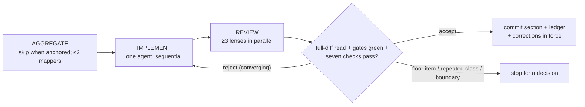
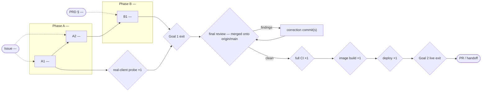

# <Project / Feature> — Goal-Driven Implementation Plan

Sources: <roadmap / PRD / ADR / issue references>
Written: <YYYY-MM-DD>

## Premise corrections

Input claims verified against the tree during mapping. Record every correction here; the
sections below are written against the corrected premise.

- <claim in the issue/PRD> — <what the code actually shows, with file:line> — <effect on scope>

## 0. Execution contract

### Roles

- Main session: orchestrator and reviewer. It plans, dispatches, verifies, updates this ledger,
  and commits. It never edits product source or product docs.
- Section implementer: exactly one at a time; writes only inside its active section; never
  commits; never delegates writing.
- Mappers and reviewers: read-only; run in parallel within the harness thread cap.

### Harness routing

Harness: `<claude | codex>` — see `references/routing-<harness>.md`.

| Role        | Requested                  | Role-confirmed | Model/effort-confirmed | Fallback used |
| ----------- | -------------------------- | -------------- | ---------------------- | ------------- |
| Implementer | `<agent / model / effort>` | `<pending>`    | `<pending>`            | `<none>`      |
| Mapper      | `<agent / model / effort>` | `<pending>`    | `<pending>`            | `<none>`      |
| Reviewer    | `<agent / model / effort>` | `<pending>`    | `<pending>`            | `<none>`      |

If the reviewer role cannot be dispatched, record `review: self (<reason>)` on every affected
ledger row and add the accepted risk to Graph Findings; the final review must then be independent.

### Global gate

```bash
<owning package full suite + affected dependents, e.g. turbo run test typecheck --affected — run once before recording>
```

Baseline result: <date, exit code, decisive output>

### Execution-environment preflight

Preflight status: pending
Checked: pending
Baseline SHA: pending
Execution realm: pending

Use `ready`, `known-baseline-red`, or `invalid-environment` after running the probes. Record
presence and reachability only; never record secret values.

| Capability                       | Probe / expected condition                                                                                     | Observed evidence          | Classification                                 |
| -------------------------------- | -------------------------------------------------------------------------------------------------------------- | -------------------------- | ---------------------------------------------- |
| Worktree and branch              | Correct repository/branch; unrelated changes isolated                                                          | `<result>`                 | `<ready / invalid-environment>`                |
| Toolchain and agent routing      | Required tool versions; every role resolved per the routing table                                              | `<result>`                 | `<ready / invalid-environment>`                |
| Required infrastructure          | DB/Redis/Docker/service DNS and ports needed by gates are reachable _from the realm that runs the gate_        | `<result or not-required>` | `<ready / invalid-environment / not-required>` |
| Credentials / external authority | Required values present and approved, unexposed                                                                | `<result or not-required>` | `<ready / invalid-environment / not-required>` |
| Host resources                   | Paths writable (no root-owned `dist`/caches); disk and memory adequate; `NODE_ENV` not inherited as production | `<result>`                 | `<ready / invalid-environment>`                |
| Running stack freshness          | Images/processes used for live evidence are at or ahead of the baseline SHA                                    | `<result or not-required>` | `<ready / invalid-environment / not-required>` |
| Baseline gate                    | The declared global gate has a valid observed result                                                           | `<result>`                 | `<ready / known-baseline-red>`                 |

#### Known blockers

Every host or environment condition that has blocked this repository's gates before, with the
handling approved in advance. Hitting one of these during EXECUTE is an `⚙` environment retry,
never a rejection round and never a user decision.

| Condition                                                 | Detection             | Pre-approved handling                                               |
| --------------------------------------------------------- | --------------------- | ------------------------------------------------------------------- |
| `<e.g. failed historical migration on the shared dev DB>` | `<command / symptom>` | `<runbook or recipe, bounded to this plan's migrations>`            |
| `<e.g. Docker-published ports unreachable from host>`     | `<symptom>`           | `<run the gate from a disposable container on the compose network>` |

### Expensive or mutating lifecycle gate budget

List every gate whose repetition costs meaningful time, money, risk, or external state. A later
input that changes what the gate consumes invalidates its evidence. Count the implementer's run
and the orchestrator's verification run separately. Smoke-run each gate's environment path once
in preflight or mark it `unproven`. Schedule the cheapest real-client probe before the first
image build.

| Gate                                                                                 | Consumes / invalidated by                                   | Planned runs (impl / orch) | Preflight             | Actual runs | Why this count is safe                                                               |
| ------------------------------------------------------------------------------------ | ----------------------------------------------------------- | -------------------------: | --------------------- | ----------: | ------------------------------------------------------------------------------------ |
| `<cheapest real-client probe: browser page view / one journey leg / one live burst>` | `<source, running stack>`                                   |                    `0 / 1` | `<proven / unproven>` |       `<n>` | `<runs before the first image build; catches own-traffic and demand mistakes early>` |
| `<schema/bootstrap gate>`                                                            | `<migrations, role grants, generated credential>`           |                  `<n / n>` | `<proven / unproven>` |       `<n>` | `<reason>`                                                                           |
| `<package/image build>`                                                              | `<source, lockfile, build args, generated assets>`          |                  `<n / n>` | `<proven / unproven>` |       `<n>` | `<reason>`                                                                           |
| `<full CI / acceptance suite>`                                                       | `<source, schema, fixtures>`                                |                  `<n / n>` | `<proven / unproven>` |       `<n>` | `<after final review, once>`                                                         |
| `<deployment + live e2e>`                                                            | `<image, runtime env/config/credentials, schema readiness>` |                  `<n / n>` | `<proven / unproven>` |       `<n>` | `<reason>`                                                                           |

### Rulings

#### Floor rulings (the user owns these)

Only items on the ruling floor: money customers pay, the public integration contract, irreversible
outward actions — or the host repository's declared floor. Approval of this plan approves exactly
these; anything broader is a new brief.

| #   | Section  | Decision                                    | Options                                                | Recommendation | Ruling                            |
| --- | -------- | ------------------------------------------- | ------------------------------------------------------ | -------------- | --------------------------------- |
| F1  | `<A2 ⚠>` | `<what changes for the customer>`           | `<a / b / c>`                                          | `<a, because>` | `<pending / ruled YYYY-MM-DD: a>` |
| F2  | all      | New stable `error.code`s this plan may mint | `<exact strings, or "none — reuse <family>">`          |                | `<pending>`                       |
| F3  | all      | Terminal external action                    | `<commit / push / PR / issue comment / deploy / none>` |                | `<pending>`                       |

#### Recorded calls (orchestrator-ruled under the floor, user-vetoable)

| #   | Section                                 | Call                                                                                                                   | Rationale                                |
| --- | --------------------------------------- | ---------------------------------------------------------------------------------------------------------------------- | ---------------------------------------- |
| R1  | `<A1>`                                  | `<e.g. additive nullable column + index>`                                                                              | `<why, with the invariant it preserves>` |
| R2  | `<B1 — enforce/gate/block/redact verb>` | Negative space: what stays open, which wind-down paths stay reachable, which body-keyed surfaces carry the gated thing | `<enumeration>`                          |

### Base drift policy

Re-baseline on `origin/main` <when: before final review / after every phase / when a stacked
predecessor merges>. If a predecessor squash-merges, <rebase only this plan's range onto the
squash commit; no history rewrite of pushed commits without an explicit ruling>.

### Rules

- Implementation is sequential; never run two implementers concurrently.
- No unrun gate may be reported as successful; a test authored but not executed blocks acceptance.
- Preserve and exclude unrelated pre-existing working-tree changes.
- In-contract correction rounds continue until the section converges. Stop only when a round
  surfaces a floor item, repeats a class the previous round was told to fix, or breaks the section
  boundary. Round count and token use are never decision boundaries.
- Environment retries (`⚙`) follow the Known blockers table and never count as rounds.
- Do not drift into future sections.



## 1. Goals — observable definition of done

### Goal 1 — <milestone>

- [ ] <observable production outcome>
- [ ] <security/reliability condition>
- [ ] <rejection clause: excess / forbidden input receives X>
- [ ] <paired admission clause: one legitimate interaction — a real page view, an honest burst — stays under the cap / is accepted; measured, not hand-picked>
- [ ] <no stale state or regression condition>

### Goal 2 — <milestone>

- [ ] <real user/system flow succeeds end to end — for a customer-facing flow, a scripted walkthrough of the assembled flow at the final-review gate>
- [ ] <audit/attribution/governance requirement>
- [ ] <failure mode degrades safely>

The plan is complete only when every goal exit test passes.

## 2. Topology graph and recommended order

### Topology graph

The graph is the primary approval surface and becomes the execution trace at completion.

- One stadium node per scope-justifying input (issue, PRD clause, explicit request); dashed
  provenance edges from an input to the sections that serve it. Every clause of an input reaches
  a section or is named in the out-of-scope list.
- One node per section, grouped by phase; solid edges for hard dependencies, dashed for soft.
  Suffix `⚠` on a section that touches the ruling floor.
- Explicit nodes for lifecycle outputs and gates whose repetition matters (credentials/config,
  migration, image build, deployment, live e2e), labeled with the planned run count.
- One diamond per goal exit test. The whole-branch final review sits on every path to
  PR/handoff and before any external or mutating gate its corrections could invalidate.
- Every section sits on a full input → section → goal path. The graph, `DEPENDS ON`, ledger,
  and recommended order agree. The section graph is acyclic.
- Marks at completion, derived from the ledger: `✅` accepted · `🔁×n` rejection rounds ·
  `⚠→` a decision brief reached the user (ruling noted) · `⇢` orchestrator-ruled inside the
  floor · `⚙×n` environment retries · `✎` goal or scope amended at completion.



### Graph Findings

Run the checklist in `references/graph-analysis.md` before approval. `None` is valid only after
every class was checked.

Resolved before approval:

- <finding class> — <node(s)> — <original problem> — <correction>

Accepted risks:

- <finding class> — <node(s)> — <why it remains> — <mitigation and review point>

Reader sweep (required whenever a section writes a new value into a shared column, enum, event
type, or registry):

- <value> — readers: <file:line, file:line> — <each handles it / provably unaffected>

At completion (trace vs findings):

- Confirmed: <finding that fired as predicted>
- Never fired: <accepted risk that stayed quiet>
- Missed: <trouble the analysis did not predict>

### Corrections in force

Factual corrections accepted in earlier sections. The orchestrator appends here at every accept
and prepends this block to every later implementer prompt.

- <date> — <section> — <corrected claim, with anchor>

### Hard dependencies

- `<X>` precedes `<Y>` because `<reason>`.

### Soft dependencies

- `<B>` follows `<A>` to reduce churn, not blocked by it.

### Recommended linear order

```text
<sections> -> cheap/local gates when ready -> real-client probe -> final review (merged on main) -> full CI ×1 -> image build ×1 -> deploy ×1 -> live goal gates -> PR/handoff
```

## 3. Sections

Use this block for every S/M vertical slice.

```md
## <ID> — <section title>

GOAL:
<Observable outcome.>

SOURCES:
<Roadmap, PRD, ADR, or issue clauses.>

TARGET:
<Repository / service / subsystem, plus the owning docs of every package written: README, PRD, overview, conformance row, OpenAPI prose.>

DEPENDS ON:
<Checked section IDs, or "none".>

IMPLEMENTER PROFILE:
<role / model / effort per the routing table>

CONTEXT TO AGGREGATE:

1. <File/module/pattern to inspect, with file:line anchors.>
2. <Existing tests to extend.>
3. <Relevant runtime path.>

WRITERS:
<Every writer of any state whose invariant this section changes, with file:line. Readers to verify follow.>

SIBLING SURFACES:
<Other modules/routes that implement the same shape (job, guard, resolver) — checked or explicitly out of scope.>

LIFECYCLE / GATE EFFECTS:

- Produces: <artifact, schema, config, credential, or external state>.
- Binding: <image build input, runtime/container input, or external-state prerequisite>.
- Consumed by: <gate IDs>.
- Invalidates prior evidence from: <gate IDs, or "none">.

IMPLEMENT:

- <Concrete vertical-slice behavior.>
- <Data/model/API/UI change.>
- <Backward-compatibility constraint.>
- <Docs to update, named.>

CONTRACT DECISION — ESCALATE:
Stop before coding and return a decision brief if the work requires an unruled change on the
ruling floor: money customers pay; the public integration contract (endpoints, shapes, stable
error codes, signature scheme, SDK surface, documented semantics); an irreversible outward action.
Anything else: decide, record `⇢` with rationale, continue.

Decision brief: product effect; 2-4 options; consequences; recommendation; evidence.

VERIFY:

- Global gate: <command>.
- Subsystem tests: <commands>; every new test proven load-bearing (revert the fix, watch it go red).
- Live/end-to-end flow: <steps and expected observable result>; running stack at or ahead of HEAD.

REVIEW:
<Lenses: security, data, contract, reliability, convention/scope, doc-truth; + capacity when a limiter/quota/timeout is touched; + evaluator soundness for journey sections.>

ACCEPTANCE:
<Exact Goal exit-test clause satisfied.>

COMMIT:
<type(scope): concise message (reference)>
```

## 4. Main-session acceptance protocol

Before accepting a section, verify: re-run gate evidence green; required DB/integration/e2e tests
actually ran; no floor item crossed without a ruling; acceptance maps to an exit test; the diff
stays within the section and excludes baseline changes; conventions followed; deferrals explicit,
safe, and tracked. Read the full diff and the CLAIMS block against the code.

On acceptance, append the ledger record and commit the section diff and this ledger change
together. On rejection, resume the same implementer with exact `file:line` gaps and continue
under the convergence rule. Refute a reviewer finding against the code when it is wrong; record
the refutation.

## 5. Progress ledger

Record schema for a checked row (one line per rejection round):

```text
- [x] A1 <title> — <exit clause> — accepted <YYYY-MM-DD> <sha> — rounds: 2 — review: independent — routing: requested=<...>; role=<...>; model/effort=<...> — cost: ~<n>k tokens / <m> agents — env-retries: 0
  - R1 failure-mode: <one line — what the reviewer found>
  - R2 doc-truth: <one line>
```

## Phase A — <milestone / subsystem>

- [ ] A1 <section title> — <exit clause>
- [ ] A2 <section title> — <exit clause>

## Phase B — <milestone / subsystem>

- [ ] B1 <section title> — <exit clause>

## Completion

- [ ] Every section is committed with its ledger record.
- [ ] Branch re-baselined on `origin/main` before final review.
- [ ] Whole-branch final review (seams, contract, conformance, reader sweep, claim decay, rollout window) is clean; corrections committed.
- [ ] Goal 1 exit tests pass with evidence.
- [ ] Goal 2 exit tests pass with evidence.
- [ ] Every budgeted gate records actual runs; overruns named in Graph Findings.
- [ ] Every deferral has a tracking issue or a machine-checkable re-entry gate.
- [ ] Topology graph marks match the ledger (validator green), re-rendered, compared with Graph Findings.
- [ ] Routing table complete; tokens per section reported.

## Deferrals

None.

When an item intentionally remains, replace `None.` with rows. `Owner / issue` must be a filed
issue number or URL, or `Re-entry gate` must be an observable, machine-checkable condition; a row
with neither fails validation.

| ID     | Class                                                           | Remaining work and risk | Owner / issue   | Re-entry gate                       | Blocks                                      | Status              |
| ------ | --------------------------------------------------------------- | ----------------------- | --------------- | ----------------------------------- | ------------------------------------------- | ------------------- |
| `<D1>` | `<coverage / environment / external-authority / product-scope>` | `<work and risk>`       | `<#123 or URL>` | `<command or observable condition>` | `<implemented / verified / shipped / none>` | `<open / resolved>` |
